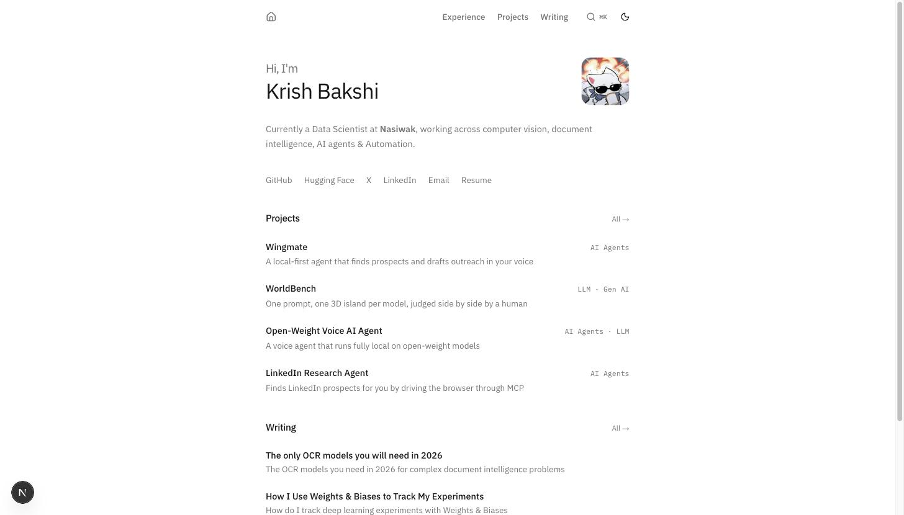

# Krish Bakshi — Portfolio

I built this to have one place that actually shows the work — the projects, the writing, and enough of the reasoning behind them — laid out the way I'd want to read it myself, instead of a résumé PDF or a LinkedIn summary doing all the talking.

It started as a way to stop re-explaining the same few projects in every conversation, and it's turned into something I keep coming back to: trimming a line here, swapping in a new demo there. Still very much a living page.

## Stack

- Next.js (App Router) + TypeScript
- Tailwind CSS, Radix UI primitives
- MDX for projects and writing
- Cloudflare R2 for images and video, Upstash Redis for view counts
- Deployed on Vercel

Live at [krishbakshi.com](https://krishbakshi.com).
